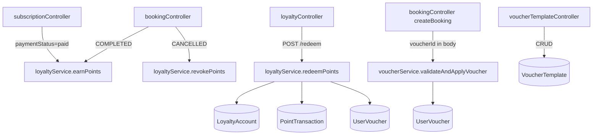

# Design Document — Loyalty Points & Vouchers

## Overview

Tính năng Loyalty Points & Vouchers cho phép khách hàng VALO PARKING tích lũy điểm từ booking theo giờ và subscription, sau đó đổi điểm lấy voucher giảm giá hoặc dịch vụ miễn phí. Điểm không hết hạn. Voucher có thời hạn 30 ngày kể từ khi đổi.

Hệ thống được thiết kế theo nguyên tắc:
- **Tính nguyên tử (atomicity)**: đổi điểm và tạo voucher trong một Mongoose session duy nhất.
- **Tính nhất quán (balance invariant)**: `balance = ΣEARN − ΣREVOKE − ΣREDEEM ≥ 0` luôn đúng.
- **Tích hợp non-intrusive**: các hook tích điểm được gọi sau khi transition trạng thái booking/subscription thành công, không làm gián đoạn luồng thanh toán chính.

---

## Architecture



Các thành phần:
- **`loyaltyService.js`** — nghiệp vụ cốt lõi: `earnPoints`, `revokePoints`, `redeemPoints` (dùng Mongoose session cho redeemPoints).
- **`voucherService.js`** — validate và apply voucher vào booking.
- **`loyaltyController.js`** — endpoints customer-facing.
- **`voucherTemplateController.js`** — endpoints admin CRUD.
- Hook tích điểm được gọi bằng pattern fire-and-log (không throw, chỉ log error) để tránh rollback luồng chính khi tích điểm lỗi.

---

## Components and Interfaces

### loyaltyService.js

```js
// Tạo/tìm LoyaltyAccount cho userId, tạo PointTransaction EARN, cộng balance
earnPoints({ userId, amount, refSource, refSourceId, session? })
// → { loyaltyAccount, pointTransaction } | void (nếu amount < 1000)

// Tìm EARN transaction theo refSourceId, tạo REVOKE, trừ balance (clamped >= 0)
revokePoints({ userId, refSource, refSourceId, session? })
// → { loyaltyAccount, pointTransaction } | void (nếu không có EARN)

// Mongoose session: trừ pointCost + tạo UserVoucher atomically
redeemPoints({ userId, templateId })
// → { loyaltyAccount, userVoucher, pointTransaction }
// throws nếu: balance < pointCost, template inactive, transaction fail
```

### voucherService.js

```js
// Validate UserVoucher (status=available, chưa hết hạn, template type)
// Tính toán discount hoặc attach BookingService price=0
validateAndApplyVoucher({ voucherId, booking, session })
// → { discountedAmount, voucherSnapshot } | throws AppError

// Đánh dấu UserVoucher status=used khi booking PAID
markVoucherUsed({ bookingId, session })
// → void
```

### loyaltyController.js — Routes: `/api/loyalty`

| Method | Path | Auth | Mô tả |
|--------|------|------|-------|
| GET | `/account` | customer | Lấy balance + lịch sử giao dịch (phân trang) |
| POST | `/redeem` | customer | Đổi điểm lấy voucher |
| GET | `/vouchers` | customer | Danh sách UserVoucher của user |

### voucherTemplateController.js — Routes: `/api/admin/voucher-templates`

| Method | Path | Auth | Mô tả |
|--------|------|------|-------|
| GET | `/` | admin | Danh sách tất cả template |
| POST | `/` | admin | Tạo mới VoucherTemplate |
| PUT | `/:id` | admin | Cập nhật template |
| PATCH | `/:id/deactivate` | admin | Deactivate (isActive=false) |
| DELETE | `/:id` | admin | Xóa (chỉ khi không có UserVoucher available) |

### Integration points

**bookingController.js** — sau khi booking chuyển `COMPLETED`:
```js
loyaltyService.earnPoints({
  userId: booking.userId,
  amount: booking.prepaidAmount,
  refSource: 'booking',
  refSourceId: booking._id,
}).catch(err => console.error('[Loyalty] earnPoints failed:', err));
```

Sau khi booking chuyển `CANCELLED`:
```js
loyaltyService.revokePoints({
  userId: booking.userId,
  refSource: 'booking',
  refSourceId: booking._id,
}).catch(err => console.error('[Loyalty] revokePoints failed:', err));
```

**subscriptionController.js** — sau khi `paymentStatus = paid`:
```js
loyaltyService.earnPoints({
  userId: subscription.user,
  amount: subscription.amount,
  refSource: 'subscription',
  refSourceId: subscription._id,
}).catch(err => console.error('[Loyalty] earnPoints (sub) failed:', err));
```

**createBooking** — nếu request body có `voucherId`:
```js
// Trong cùng payment session
await voucherService.validateAndApplyVoucher({ voucherId, booking, session });
```

---

## Data Models

### LoyaltyAccount

```js
// backend/src/models/LoyaltyAccount.js
{
  userId: { type: ObjectId, ref: 'User', required: true, unique: true },
  balance: { type: Number, default: 0, min: 0 },
}
// Index: userId (unique)
```

### PointTransaction

```js
// backend/src/models/PointTransaction.js
{
  loyaltyAccountId: { type: ObjectId, ref: 'LoyaltyAccount', required: true },
  userId:           { type: ObjectId, ref: 'User', required: true },  // denormalized for query convenience
  type:             { type: String, enum: ['EARN', 'REVOKE', 'REDEEM'], required: true },
  amount:           { type: Number, required: true, min: 0 },         // always positive, type encodes direction
  balanceBefore:    { type: Number, required: true },
  balanceAfter:     { type: Number, required: true },
  refSource:        { type: String, enum: ['booking', 'subscription', 'voucher'], default: null },
  refSourceId:      { type: ObjectId, default: null },
}
// Timestamps: true
// Index: loyaltyAccountId + createdAt desc, userId + type + refSourceId
```

### VoucherTemplate

```js
// backend/src/models/VoucherTemplate.js
{
  name:            { type: String, required: true, trim: true },
  type:            { type: String, enum: ['PERCENT_DISCOUNT', 'FREE_SERVICE'], required: true },
  pointCost:       { type: Number, required: true, min: 1 },         // integer > 0
  discountPercent: { type: Number, min: 1, max: 100, default: null }, // required if PERCENT_DISCOUNT
  serviceId:       { type: ObjectId, ref: 'Service', default: null }, // required if FREE_SERVICE
  isActive:        { type: Boolean, default: true },
}
// Timestamps: true
// Validation: discountPercent required when type=PERCENT_DISCOUNT; serviceId required when type=FREE_SERVICE
```

### UserVoucher

```js
// backend/src/models/UserVoucher.js
{
  userId:      { type: ObjectId, ref: 'User', required: true },
  templateId:  { type: ObjectId, ref: 'VoucherTemplate', required: true },
  status:      { type: String, enum: ['available', 'used', 'expired'], default: 'available' },
  redeemedAt:  { type: Date, default: Date.now },
  expiresAt:   { type: Date, required: true },  // redeemedAt + 30 ngày, set in pre-save
  usedAt:      { type: Date, default: null },
  bookingId:   { type: ObjectId, ref: 'Booking', default: null },
}
// Timestamps: true
// Index: userId + status, bookingId (sparse)
// pre-save: if new → expiresAt = redeemedAt + 30*24*60*60*1000
```

### Mở rộng Booking.paymentBreakdownSnapshot

Thêm 3 field vào sub-document hiện có trong `Booking.js`:
```js
paymentBreakdownSnapshot: {
  // ...các field hiện có giữ nguyên...
  voucherId:       { type: ObjectId, ref: 'UserVoucher', default: null },
  voucherDiscount: { type: Number, min: 0, default: null },   // số tiền được giảm
  discountedTotal: { type: Number, min: 0, default: null },   // prepaidAmount sau khi giảm
}
```

---

## Correctness Properties

*A property is a characteristic or behavior that should hold true across all valid executions of a system — essentially, a formal statement about what the system should do. Properties serve as the bridge between human-readable specifications and machine-verifiable correctness guarantees.*

### Property 1: Points calculation uses floor division

*For any* payment amount `A` (VND, integer ≥ 0), the earned points SHALL equal `Math.floor(A / 1000)`. In particular, `Math.floor(1999/1000) = 1`, `Math.floor(999/1000) = 0`, and no intermediate value is ever rounded up.

**Validates: Requirements 1.1, 1.5, 3.1, 3.5, 9.1**

---

### Property 2: Earning points increases balance by the calculated amount

*For any* LoyaltyAccount with balance `B` and a payment amount `A ≥ 1000`, after calling `earnPoints`, the balance SHALL equal `B + Math.floor(A / 1000)`.

**Validates: Requirements 1.2, 3.2**

---

### Property 3: Balance accounting identity

*For any* LoyaltyAccount, at all times:
`balance = Σ(EARN.amount) − Σ(REVOKE.amount) − Σ(REDEEM.amount)`
where the sums are taken over all PointTransactions belonging to that account.

**Validates: Requirements 4.2, 9.2**

---

### Property 4: Balance non-negative invariant

*For any* LoyaltyAccount and *any* sequence of operations, `balance >= 0` always holds. No single operation shall leave the balance negative.

**Validates: Requirements 4.3, 2.5, 9.3**

---

### Property 5: Revoke is clamped to earned amount and current balance

*For any* booking that earned N points, if subsequently cancelled, the revoked amount SHALL equal `min(N, currentBalance)` — never more than N and never leaving the balance below 0.

**Validates: Requirements 2.1, 2.4, 9.4**

---

### Property 6: Redemption is atomic

*For any* redemption operation that debits P points and creates one UserVoucher, if any part of the operation fails (e.g., concurrent balance conflict, DB error), THEN both the point deduction AND the UserVoucher creation SHALL be rolled back, leaving the LoyaltyAccount balance and the UserVoucher collection unchanged.

**Validates: Requirements 6.4, 6.8, 9.5**

---

### Property 7: UserVoucher expires exactly 30 days after redemption

*For any* UserVoucher created by a redemption, `expiresAt = redeemedAt + 30 * 24 * 60 * 60 * 1000` milliseconds (i.e., exactly 30 calendar days).

**Validates: Requirements 6.5**

---

### Property 8: Insufficient balance rejects redemption

*For any* redemption request where `LoyaltyAccount.balance < VoucherTemplate.pointCost`, the operation SHALL be rejected with an error, and the balance SHALL remain unchanged.

**Validates: Requirements 6.1, 6.2**

---

### Property 9: Voucher becomes used when booking is paid

*For any* Booking that has an associated UserVoucher and transitions to `status = PAID`, the UserVoucher SHALL transition to `status = used` and `usedAt` SHALL be set to the current timestamp.

**Validates: Requirements 7.7, 8.5**

---

### Property 10: Used voucher cannot be applied again (idempotent rejection)

*For any* UserVoucher with `status = used`, any subsequent attempt to apply it to a Booking SHALL be rejected with an error, and no change SHALL be made to the Booking or the voucher.

**Validates: Requirements 7.9, 8.6, 9.6**

---

### Property 11: Expired voucher is always rejected regardless of status

*For any* UserVoucher where `currentTime >= expiresAt`, any attempt to apply it SHALL be rejected, regardless of the voucher's `status` field.

**Validates: Requirements 7.3, 7.4, 8.1, 9.7**

---

### Property 12: Percent discount calculation uses floor division

*For any* valid `PERCENT_DISCOUNT` UserVoucher with `discountPercent D` applied to a Booking with `prepaidAmount A`, the discounted total SHALL equal `Math.floor(A * (1 - D / 100))`.

**Validates: Requirements 7.5**

---

### Property 13: Transaction history is ordered descending by creation time

*For any* LoyaltyAccount, the list of PointTransactions returned by `GET /api/loyalty/account` SHALL be ordered by `createdAt` descending (most recent first).

**Validates: Requirements 4.4**

---

### Property 14: VoucherTemplate discountPercent is in [1, 100]

*For any* `PERCENT_DISCOUNT` VoucherTemplate, `discountPercent` SHALL be an integer in the closed range [1, 100]. Values outside this range SHALL be rejected at creation and update.

**Validates: Requirements 5.2**

---

## Error Handling

| Scenario | HTTP | Message |
|---|---|---|
| Balance < pointCost khi redeem | 400 | `Insufficient loyalty points` |
| VoucherTemplate.isActive = false | 400 | `Voucher template is not available` |
| UserVoucher.status != available | 400 | `Voucher has already been used` |
| UserVoucher hết hạn | 400 | `Voucher has expired` |
| Áp dụng cùng voucher 2 lần | 400 | `Voucher has already been used` |
| Service.isActive = false trong FREE_SERVICE | 400 | `Service associated with voucher is unavailable` |
| Xóa VoucherTemplate có UserVoucher available | 400 | `Cannot delete template with active vouchers` |
| Atomic session fail | 500 (rollback) | `Redemption failed, please try again` |
| LoyaltyAccount không tồn tại khi revoke | — | silent no-op (log only) |

Tất cả lỗi dùng pattern `AppError` (có `statusCode`) để đi qua `errorHandler` middleware hiện có.

Các hook tích điểm (`earnPoints`, `revokePoints`) được gọi với `.catch(err => console.error(...))` — lỗi tích điểm không làm fail request chính (booking/subscription vẫn thành công).

---

## Testing Strategy

### Dual Testing Approach

Dùng cả **unit tests** (ví dụ cụ thể, edge cases) và **property-based tests** (kiểm tra tính đúng đắn trên toàn bộ không gian đầu vào).

**Library đề xuất**: [`fast-check`](https://github.com/dubzzz/fast-check) (JavaScript/Node.js, không cần build config đặc biệt).

```
npm install --save-dev fast-check
```

### Unit Tests (Jest)

Tập trung vào:
- `earnPoints` với `amount < 1000` → không tạo PointTransaction.
- `revokePoints` khi không có EARN transaction → no-op.
- Admin xóa VoucherTemplate có `available` voucher → lỗi 400.
- Subscription bị cancel → không revoke điểm.
- `FREE_SERVICE` voucher tạo BookingService với `price = 0`.
- Áp dụng 2 `FREE_SERVICE` voucher vào cùng booking → lỗi.
- `PERCENT_DISCOUNT` voucher không apply được vào subscription.

### Property-Based Tests (fast-check)

Mỗi test chạy tối thiểu 100 iterations. Mỗi test được gắn tag comment:
```
// Feature: loyalty-voucher, Property N: <property text>
```

**Test mapping:**

| Property | Test Description |
|---|---|
| P1 | `fc.integer({min:0, max:10_000_000})` → verify `Math.floor(a/1000)` |
| P2 | Arbitrary balance + amount ≥ 1000 → balance increases by floor(amount/1000) |
| P3 | Arbitrary sequence of EARN/REVOKE/REDEEM ops → balance equals formula |
| P4 | Same sequence → balance never < 0 at any step |
| P5 | Earn N points, spend some, cancel booking → revoke = min(N, currentBalance) |
| P6 | Simulate DB failure mid-redeem → balance unchanged, no UserVoucher created |
| P7 | Any redemption → expiresAt === redeemedAt + 30d (in ms) |
| P8 | `fc.integer({min:0})` where balance < pointCost → redeemPoints throws |
| P9 | Any booking with voucher → on PAID, voucher.status = 'used' |
| P10 | Apply used voucher → rejected every time (idempotent) |
| P11 | Any voucher with expiresAt in past → rejected regardless of status |
| P12 | `fc.integer({min:1, max:100})` discountPercent, `fc.integer({min:0})` amount → floor(A*(1-D/100)) |
| P13 | Insert N transactions → returned list is sorted by createdAt desc |
| P14 | `fc.integer()` discountPercent outside [1,100] → VoucherTemplate creation rejected |
